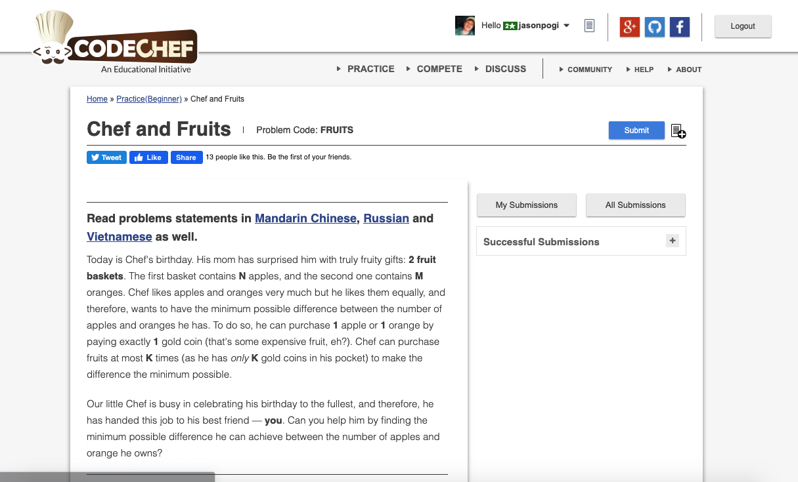

# Codechef-Chef-and-Fruits
### Problem

### Program Simulation
<pre>
  Sample Input:
  3
  3 4 1
  5 2 1
  3 4 3

  *First Test - Case*
  max_cost = max(3, 4) // 4
  max_cost = 4
  min_cost = min(3, 4) // 3
  min_cost = 3
  ans = 4 - min(3 + 1, 4)
  ans = 0

  print ans = 0

  *Second Test - Case*
  max_cost = max(5, 2) // 5
  max_cost = 5
  min_cost = min(5, 2) // 2
  min_cost = 2
  ans = 5 - min(2 + 1, 5) 
  ans = 2

  print ans = 2

  *Third  Test - Case*
  max_cost = max(3, 4) // 4
  max_cost = 4
  min_cost = min(3, 4) // 3
  min_cost = 3
  ans = 4 - min(3 + 3, 4) 
  ans = 0

  print ans = 0

  Final Output:
  0
  2
  0
</pre>
